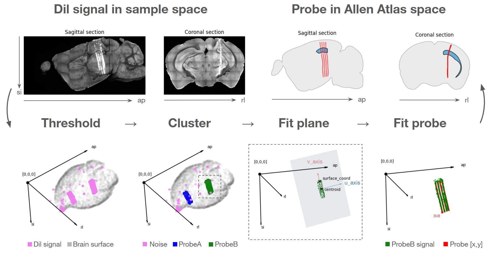

# brainreg_probe
This repository aims to automate the process of registering a silicon probe to brain anatomy. 

This is done by fitting probe geometry loaded from [probe interface](https://github.com/SpikeInterface/probeinterface) to signal data from Dil coated probes, following [procedures descrbed by BrainGlobe](https://brainglobe.info/tutorials/silicon-probe-tracking.html), which is then registered to the Allen brain atlas using [brainreg](https://github.com/brainglobe/brainreg).




> *Example output*: probe_df.htsv, a multi-index pandas dataframe:
> 
>|     | probe_coords<br>x  y | allen_atlas_coords<br>i  j  k | structure <br> name  acronym id|
>|:---:|:------------------:|:----------------------------:|:-----------------------------:|
>| ... | ... | ... | ... |
>| 450 | 0.0  3375.0 | 7323  2111  7693 | Field CA1     CA1  382 |
>| 452 | 0.0  3390.0 | 7323  2084 7699 | Field CA1      CA1  382 |
>| 453 | 32.0  3390.0 | 7355  2097 7686 | Field CA1      CA1  382 |
>| 454 | 0.0  3405.0 | 7323  2070 7702 | Field CA1      CA1  382 |
>| 455 | 32.0  3405.0 | 7355  2070 7692 | Field CA1      CA1  382 |
>| ... | ... | ... | ... |

>
---
# Tutorial
The following tutorial tries to break it down to just *three easy steps*, organised as follows:

1. Setup and installation
2. running brainreg (HPC cluster via SLURM)
3. probeinterface tracing (HPC cluster via SLURM)

We assume that the data is stored on a HPC server managed via SLURM. We recommend running the 'notebook.ipynb' for a smooth step-by-step walkthrough, examples, and details.

The tutorial here is meant to supplement this notebook.
---
## Step 1: Setup and installation

>[!TIP]
> All the code will run seamlessly if your data is organised as below. Otherwise please change script paths.
>```
>.
>└── experiment/ 
>    ├── code/    <-- (make this your working directory)
>    │   └── brainreg_probe/  
>    └── data/ 
>        ├── raw_data/
>        │   └── histology/    <-- (RAW_HISTOLOGY_PATH)
>        │       └── <subject_ID>/
>        │           └── <brainsaw outputs>
>        └── preprocessed_data/
>            └── brainreg/    <-- (PREPROCESSED_BRAINREG_PATH)
>                └── <subject_ID>/ 
>```

- Navigate to your code folder (see tip above) and clone the current repository:
```
git clone https://github.com/charlesdgburns/brainreg_probe.git
```

- Next, you want to set up a a [conda](https://www.anaconda.com/docs/getting-started/miniconda/install) environment, which will be called `histology` and contains all the required python packages:
```
conda create -f ./brainreg_probe/environment.yml 
conda activate histology
``` 


>[!CAUTION]
> To run a notebook on a HPC cluster, please make sure to do so on a compute node (_not_ a gateway node).
> See [this tutorial](https://howto.neuroinformatics.dev/programming/vscode-with-slurm-job.html) or try the following lines of code:
>``` 
>srun --nodes=1 --ntasks-per-node=1 --cpus-per-task=8 -time=12:00:00 --mem=64G --pty bash -i
>    #wait for resources to be allocated
>source /etc/profile.d/modules.sh
>module load miniconda
>conda activate histology     #sometimes requires  'source activate histology'
>jupyter-notebook --no-browser --ip=0.0.0.0 --port 8888
>```
> then copy+paste one of the suggested URL links when selecting the Jupyter kernel (`Select Another Kernel...` -> `Existing Jupyter Server...`)

---
## Step 2: run [brainreg](https://github.com/brainglobe/brainreg)

Before running `brainreg` it is crucial to specify the orientation of the inputs. Please read the [brainglobe orientations docs](https://brainglobe.info/documentation/setting-up/image-definition.html). There's a helper function to check this:

```
from brainreg_probe import run_brainreg as rub  
rub.check_brain_orientations() 
```

If not using a notebook, the output can be found at: `PREPROCESSED_BRAINREG_PATH/<subject_ID>/check_orientation.png`


> [!NOTE] 
>**Orientation** of data is important here and can be confusing. Voxel data is a big 3D stack of images which can be indexed in each dimension. However, the dimension of the voxel data is not always ordered as X,Y,Z.
>Brainreg output is reoriented to the allen brain atlas, which follows an image axis convention with origin at 'RAS', the right, anterior, superior corner. This corresponds to a brainglobe orientation of `asr` (if the brain is sliced along the anterior-posterior axis).
>
> | Direction | Acronym | Voxel Dimension | Image Axis | Example |
> |:-----------:|:---------:|:-----------------:|:------------:|---------|
> | Anterior → Posterior | `ap` | `[0]` or `i` | **Z** | `data[z, :, :]` |
> | Superior → Inferior | `si` | `[1]` or `j` | **Y** | `data[:, y, :]` |
> | Right → Left | `rl` | `[2]` or `k` | **X** | `data[:, :, x]` |
>
> The reason for this is that packages like `numpy` and `skimage` follow the same image data convention for data transfomrations (inhereting this convention from C++ image processing libraries).
>
> To avoid confusion with `X`, `Y`, `Z` ordering in the output, we refer to `downsample_coords` in voxel data dimension order `i`, `j`, `k`.

>[!TIP] 
>Data orientation and signal channel assignment can also be checked locally using [napari](https://napari.org/stable/). See the section **Manual data check and annotations** below.

---
## Step 3: register probes to the signal data
This should ideally be as simple as:
``` 
from brainreg_probe import probeinterface_tracing as pit
pit.get_probe_registration_df(subject_ID)
```

---

# Manual data check and annotations
You may need to manually check the histology and annotate where the probe was, for example in case of a poor Dil signal.
This will have to be done locally.

### Step 1: install napari
install `napari` following their [instructions](https://napari.org/dev/tutorials/fundamentals/installation.html). 

### Step 2: open data
for 

You may run `brainreg` on a local machine, making sure to use the following command:
```brainreg <input_path> <output_path> --additional <dye_channel_path> -v <Z voxel size> <Y voxel size> <X voxel size> --orientation <orientation> --atlas allen_mouse_10um```

We refer to