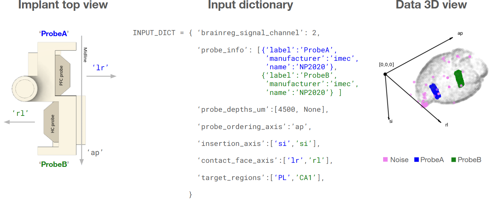
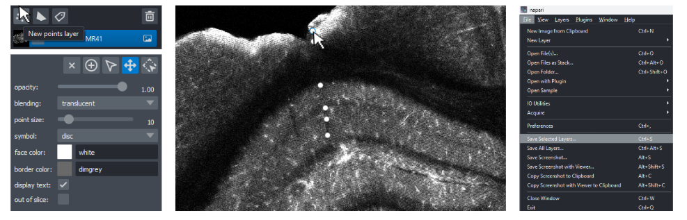

# brainreg_probe
This repository aims to automate the process of registering a silicon probe to brain anatomy. 

This is done by fitting probe geometry loaded from [probe interface](https://github.com/SpikeInterface/probeinterface) to signal data from Dil coated probes, following [procedures descrbed by BrainGlobe](https://brainglobe.info/tutorials/silicon-probe-tracking.html), which is then registered to the Allen brain atlas using [brainreg](https://github.com/brainglobe/brainreg).


> **Example output**: probe_anatomy.htsv, a multi-index [pandas dataframe](https://pandas.pydata.org/docs/reference/api/pandas.DataFrame.html):
> 
>|     | probe_coords       | allen_atlas_coords                    |structure|
>|:---:|:------------------:|:-------------------------------------:|:-------------------------------:|
>|     |x  y | i  j  k | name  acronym  id |
>| ... | ... | ... | ... |
>| 452 | 0.0  3390.0 | 7323  2084 7699 | Field CA1  CA1  382 |
>| 453 | 32.0  3390.0 | 7355  2097 7686 | Field CA1  CA1  382 |
>| 454 | 0.0  3405.0 | 7323  2070 7702 | Field CA1  CA1  382 |
>| ... | ... | ... | ... |

>
---
# Tutorial
The following tutorial tries to break it down to just *three easy steps*, organised as follows:

1. setup and installation
2. running brainreg (HPC cluster via SLURM)
3. probeinterface tracing (HPC cluster via SLURM)

We assume that the data is stored on a HPC server managed via SLURM. We recommend running the 'notebook.ipynb' for a smooth step-by-step walkthrough, examples, and details.

The tutorial here is meant to supplement this notebook.

---
## Step 1: setup and installation

>[!TIP]
> All the code will run seamlessly if your data is organised as below. Otherwise please change script paths.
>```
>.
>└── experiment/ 
>    ├── code/    <-- (make this your working directory)
>    │   └── brainreg_probe/  
>    └── data/ 
>        ├── raw_data/
>        │   └── histology/    <-- (RAW_HISTOLOGY_PATH)
>        │       └── <subject_ID>/
>        │           └── <brainsaw outputs>
>        └── preprocessed_data/
>            └── brainreg/    <-- (PREPROCESSED_BRAINREG_PATH)
>                └── <subject_ID>/ 
>```

- Navigate to your code folder and clone the current repository:
```
git clone https://github.com/charlesdgburns/brainreg_probe.git
```

- Next, you want to set up a a [conda](https://www.anaconda.com/docs/getting-started/miniconda/install) environment, which will be called `histology` and contains all the required python packages:
```
conda create -f ./brainreg_probe/environment.yml 
conda activate histology
``` 


>[!CAUTION]
> To run a notebook on a HPC cluster, please make sure to do so on a compute node (_not_ a gateway node).
> See [this tutorial](https://howto.neuroinformatics.dev/programming/vscode-with-slurm-job.html) or try the following lines of code:
>``` 
>srun --nodes=1 --ntasks-per-node=1 --cpus-per-task=8 -time=12:00:00 --mem=64G --pty bash -i
>    #wait for resources to be allocated
>source /etc/profile.d/modules.sh
>module load miniconda
>conda activate histology     #sometimes requires  'source activate histology'
>jupyter-notebook --no-browser --ip=0.0.0.0 --port 8888
>```
> then copy+paste one of the suggested URL links when selecting the Jupyter kernel (`Select Another Kernel...` -> `Existing Jupyter Server...`)

---
## Step 2: run [brainreg](https://github.com/brainglobe/brainreg)

Before running `brainreg`, it is crucial to specify the orientation of the inputs. Please read the [brainglobe orientations docs](https://brainglobe.info/documentation/setting-up/image-definition.html). There's a helper function to check this:

```
from brainreg_probe import run_brainreg as rub  
rub.check_brain_orientations() 
```

If not using a notebook, the output can be found at: `PREPROCESSED_BRAINREG_PATH/<subject_ID>/check_orientation.png`


> [!NOTE] 
>**Orientation** of data is important here and can be confusing. Voxel data is a big 3D stack of images which can be indexed in each dimension. However, the dimension of the voxel data is not always ordered as X,Y,Z.
>Brainreg output is reoriented to the allen brain atlas, which follows an image axis convention with origin at 'RAS', the right, anterior, superior corner. This corresponds to a brainglobe orientation of `asr` (if the brain is sliced along the anterior-posterior axis).
>
> | Direction | Acronym | Voxel Dimension | Image Axis | Example |
> |:-----------:|:---------:|:-----------------:|:------------:|---------|
> | Anterior → Posterior | `ap` | `[0]` or `i` | **Z** | `data[z, :, :]` |
> | Superior → Inferior | `si` | `[1]` or `j` | **Y** | `data[:, y, :]` |
> | Right → Left | `rl` | `[2]` or `k` | **X** | `data[:, :, x]` |
>
> The reason for this is that packages like `numpy` and `skimage` follow the same image data convention for data transfomrations (inhereting this convention from C++ image processing libraries).
>
> To avoid confusion with `X`, `Y`, `Z` ordering in the output, we refer to `downsample_coords` and `allen_atlas_coords` in voxel data dimension order `i`, `j`, `k`.

>[!TIP] 
>Data orientation and signal channel assignment can also be checked locally using [napari](https://napari.org/stable/). See the section **Manual data check and annotations** below.

---
## Step 3: register probes to the signal data
Before we can register the probe to the signal, we need to provide some information about the implant and surgery to make sure the orientation is correct. This input is structured as a dictionary, which can be set as a global variable in `probeinterface_tracing.py` before running the following:
``` 
from brainreg_probe import probeinterface_tracing as pit
pit.run_probeinterface_tracking()
```

>**Example input:** see below for an example input dictionary for an implant with two probes:
>
> 
> Note that `contact_face_axis` is the vector pointing in the direction that the eletrode array contacts are facing. Here we assumed that this was the same direction as the tapered edge Neuropixel 2.0 probes (though this is not clearly [documented](https://www.neuropixels.org/_files/ugd/328966_2b39661f072d405b8d284c3c73588bc6.pdf)).


---
# Debugging failed registrations
There are three main issues that can arise:
- 1: bad signal
- 2: poor clustering
- 3: bad depth estimation
To identify the culprit, we suggest running the `get_probe_registration_df()` function line-by-line as in the 'Probefitting methodological details' section of the interactive notebook. After running this, it can be helpful to get an interactive plot of the signal using `puf.plot_3d(signal_df)`.
You may also want to plot each cluster of the signal, to check whether there could be an issue there. Lastly, if there is poor depth estimation, we suggest manually inputting the depth of the probe, which will then be fixed.

If the issue is bad signal (1), see instructions for manual annotation of points below. 

If the issue is poor clustering (2), try adjusting `DBSCAN_min_samples` on the data for the single subject. You may have a large cluster of noise that you want to ignore (increase DBSCAN_min_samples) or very few datapoints of signal (decrease DBSCAN_min_samples).

If the issue is bad depth estimation (3), try manually setting `probe_depth_um` in the `input_dict` for that subject according to the depth estimated during surgery. 

If you encounter any other issue, please raise an issue on this repository for some help!

# Manual data check and annotations
You may need to manually check the histology and annotate where the probe was, for example in case of poor (or no) Dil signal. This will have to be done locally. It is assumed that you have already run brainreg and have local copies of both the inputs and outputs to brainreg.
>```
>.
>└── experiment/ 
>    └── data/ 
>        ├── raw_data/
>        │   └── histology/    <-- (RAW_HISTOLOGY_PATH)
>        │       └── <subject_ID>/
>        │           └── <brainsaw outputs = brainreg inputs>
>        └── preprocessed_data/
>            └── brainreg/    <-- (PREPROCESSED_BRAINREG_PATH)
>                └── <subject_ID>/ 
>                    └── <brainreg outputs>
>                    └── '<subject_ID>_manual_points.xml'   <--- (MANUALLY ANNOTATED POINTS GO HERE)
>```

### Step 1: install napari
install `napari` following their [instructions](https://napari.org/dev/tutorials/fundamentals/installation.html). 

### Step 2: check brainreg outputs
Please double-check that the signal really is missing by opening the downsampled data. We refer to [brainglobe's tutorial](https://brainglobe.info/tutorials/tutorial-whole-brain-registration.html#).
You may have to specifically open the signal file, for example if the signal was in channel 2:

```File -> Open File(s) as stack -> path/to/subject_ID/allen_mouse_10um/downsampled_2.tiff```

This is also a good opportunity to check (or marvel at the fact) that brainreg has identified boundaries and brain regions correctly.

It can help to view the downsampled data in 3D view (hit the box in the lower left corner of napari).

### Step 3: manually annotate probe points

For the best image quality, you want to annotate the highest resolution data from the brainsaw. Here you may try using either the signal channel ID (often 2) or the reference channel used for brainreg (often 3).
```File -> Open Folder -> path/to/subject_ID/stitched_Images_100/<channel_ID> ```
If prompted to 'choose reader', make sure to use `napari-builtins`. You may need to adjust the `contrast limits` and `gamma` sliders to better see the data. You may rename the layer to the subject_ID by double-clicking on the layer.

Next, create a points layer and get ready to annotate. The name of the game is to try to identify probe shanks by looking at artefacts in the data. Be careful not to confuse blood vessels for a probe shank - these are often more curvy than a shank. Below we have an example from a dual-probe headstage where both probes (cambridgeneurotech) are targetting CA1 in dorsal hippocampus. One of the probes' shanks has been annotated. After annotating all visible evidence of shanks, the points should be exported to a file named `<subject_ID>_manual_points.xml` and placed in the same folder as the brainreg outputs. Now you should be able to run `pit.run_probeinterface_tracking()` again, this time with the manually annotated points being loaded and added to the `signal_df` for mapping probe coordinates to registered brain regions.



>![TIP]
> To find shank lesions, it can help to scroll through the anterior-posterior axis while looking at coronal sections of the brain region (`ctrl + scroll wheel`). 
>Bear in mind what orientation the data is in (see note above), as the left side of the coronal section might correspond to either the left or right hemisphere of the brain.
> While using the points tool, holding down `spacebar` will let you drag around the image.

# Citations

If you found this little repo helpful, please make sure to properly cite the software used! The current repository doesn't have a paper to reference, but relies on key resources, so consider citing code using a couple sentences like the following:

> Code used to track silicon probes is available at (https://github.com/cognitive-circuits/brainreg_probe). 
> Histology data was registered to the 10um Allen Mouse Brain Atlas [(Wang et al. 2020;](https://www.cell.com/cell/pdf/S0092-8674(20)30402-5.pdf)[ Claudi et al., 2020)](https://joss.theoj.org/papers/10.21105/joss.02668) using brainreg [(Tyson et al., 2022;](https://www.nature.com/articles/s41598-021-04676-9)[ Niedworok et al., 2016)](https://www.nature.com/articles/ncomms11879). 
> Signal from Dil dye was then thresholded, clustered, and fit to the geometry of the probe loaded from probeinterface [(Garcia et al., 2022)](https://www.frontiersin.org/journals/neuroinformatics/articles/10.3389/fninf.2022.823056/full).
> Data registered to the atlas was then plotted using brainrender [(Claudi et al., 2021)](https://elifesciences.org/articles/65751).


The full citations mentioned above are:

The Allen Mouse Brain Atlas (10um):
>Wang, Q., Ding, S. L., Li, Y., Royall, J., Feng, D., Lesnar, P., ... & Ng, L. (2020). The Allen mouse brain common coordinate framework: a 3D reference atlas. Cell, 181(4), 936-953.

The brainglobe API used to access the atlas:
>Claudi, F., Petrucco, L., Tyson, A. L., Branco, T., Margrie, T. W. and Portugues, R. (2020). BrainGlobe Atlas API: a common interface for neuroanatomical atlases. Journal of Open Source Software, 5(54), 2668, <https://doi.org/10.21105/joss.02668>

The brainreg paper:
> Tyson, A. L., V&eacute;lez-Fort, M.,  Rousseau, C. V., Cossell, L., Tsitoura, C., Lenzi, S. C., Obenhaus, H. A., Claudi, F., Branco, T.,  Margrie, T. W. (2022). Accurate determination of marker location within whole-brain microscopy images. Scientific Reports, 12, 867 [doi.org/10.1038/s41598-021-04676-9](https://doi.org/10.1038/s41598-021-04676-9)

The aMAP (original brainreg pipeline) paper:
>Niedworok, C.J., Brown, A.P.Y., Jorge Cardoso, M., Osten, P., Ourselin, S., Modat, M. and Margrie, T.W., (2016). AMAP is a validated pipeline for registration and segmentation of high-resolution mouse brain data. Nature Communications. 7, 1–9. <https://doi.org/10.1038/ncomms11879>

The probeinterface package for loading probe geometry:
>Garcia S, Sprenger J, Holtzman T and Buccino AP (2022) ProbeInterface: A Unified Framework for Probe Handling in Extracellular Electrophysiology. Front. Neuroinform. 16:823056. doi: 10.3389/fninf.2022.823056

The brainrender software for pretty plots:
> Claudi, F., Tyson, A. L., Petrucco, L., Margrie, T.W., Portugues, R.,  Branco, T. (2021) "Visualizing anatomically registered data with Brainrender&quot; <i>eLife</i> 2021;10:e65751 [doi.org/10.7554/eLife.65751](https://doi.org/10.7554/eLife.65751)
